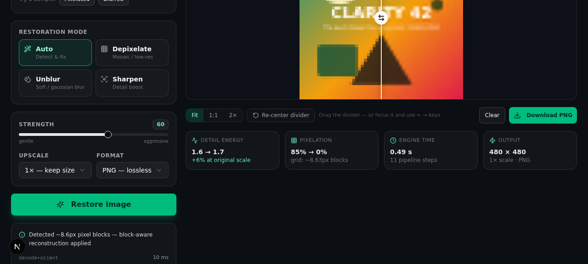

# PixelRevive

**A browser-based image restoration studio — depixelate mosaic/censored images, remove Gaussian blur via real deconvolution, and sharpen detail. 100% client-side workflow, 100% honest about what physics allows.**

[](.github/workflows/ci.yml)
[](#quickstart)
[](https://nextjs.org)
[](LICENSE)



---

## ⚠️ The honest truth about "100% accuracy"

You may have come here looking for a tool that restores pixelated or blurred
images "with 100% accuracy". **No such tool exists, and none ever will** — not
this one, not a commercial one, not a future AI one. Here is why, stated up
front so you can calibrate your expectations:

- **Pixelation and blur are lossy operations.** They average away spatial
  detail, and information that has been destroyed cannot be recreated — only
  plausibly guessed. Many different original images produce the *exact same*
  pixelated/blurred result, so "the original" is mathematically unrecoverable
  (the inverse problem is ill-posed).
- **What a good tool can do** is invert every part of the degradation that
  *is* mathematically recoverable, and reconstruct the rest as faithfully as
  the surviving signal allows. That is exactly what PixelRevive does — with
  measurable before/after metrics, not marketing claims.
- **What AI-based tools do differently** is hallucinate *plausible* detail
  (faces, text, textures). The result can look convincing while being
  factually wrong. PixelRevive deliberately stays in signal-processing
  territory: everything it shows you was actually recovered from your image.

If someone promises 100% recovery, they are selling you a guess and calling
it ground truth.

## What it does

| Mode | What happens under the hood | Best for |
|------|-----------------------------|----------|
| **Auto** | Detects pixelation block size + blur level, routes to the right pipeline | Unknown degradation |
| **Depixelate** | Grid-aware mosaic reconstruction: block detection → area downsample → Lanczos super-sampling → iterative back-projection → edge-aware bilateral | Censored/mosaic images, low-res upscale, pixel art |
| **Unblur** | Richardson-Lucy deconvolution on the luma plane with a separable Gaussian PSF | Gaussian/out-of-focus softness |
| **Sharpen** | Luma-only unsharp masking with halo control | Mildly soft photos, screenshots |

Every run returns:

- The restored image (PNG / JPEG / WebP, 1× / 2× / 4× upscale)
- A **process report** (JSON, `X-Process-Report` header): detected pixel block
  size, Laplacian variance and total-variation before/after, per-step timings
- An interactive **before/after wipe slider** so you can verify the change
  pixel-by-pixel instead of trusting a thumbnail

## Quickstart

```bash
git clone https://github.com/<your-name>/pixelrevive.git
cd pixelrevive
npm install        # Node.js >= 20
npm run dev        # → http://localhost:3000
```

Production:

```bash
npm run build
npm start
```

> **Note:** `next/font/google` downloads the Geist fonts at build time, so the
> first build needs internet access.

## Using the studio

1. **Drop, paste, or upload** an image (up to 25 MB).
2. Pick a **mode** — *Auto* analyzes the image and picks a pipeline for you.
3. Adjust **strength** (0–100) and **upscale** (1× / 2× / 4×).
4. Inspect the result with the **comparison slider** (drag to wipe, arrow keys
   work too), zoom to Fit / 1:1 / 2×, then **download** in your chosen format.

No account, no upload to third parties — the image is processed by the server
you're running (or self-hosting) and immediately discarded.

## How it works

PixelRevive is not a wrapper around someone's ML model. The restoration
engine is hand-rolled signal processing in pure TypeScript
([`src/lib/algorithms.ts`](src/lib/algorithms.ts)) orchestrated by
[`sharp`](https://sharp.pixelplumbing.com/) for codec work and resizing.

### 1. Pixel-block detection

A pixelated image is a low-resolution grid that was scaled up with
nearest-neighbor. The detector scans horizontal and vertical **boundary
differences**, clusters the intervals between equal-value boundaries, and
finds the spacing that explains them harmonically (phase-free, so it works
regardless of where the grid lands, and on non-integer ratios like 8.57 px).
Horizontal and vertical estimates must agree within ±0.75 px before a
mosaic is declared.

### 2. Grid-aware depixelation

Once the block size `b` is known, the original pixel grid is recoverable
*exactly*:

```
pixelated image
   → area-downsample to the true grid (b×b cells → 1 px)
   → Lanczos3 super-sample to target size
   → iterative back-projection (2–3 passes: re-blur the estimate,
     add the difference back — recovers high-frequency content)
   → soft bilateral filter (flattens grid residue, keeps real edges)
   → scale-aware unsharp (σ scaled by the upscale factor)
```

### 3. Richardson-Lucy deblurring

Gaussian blur is modeled as convolution with a known PSF. PixelRevive runs
**Richardson-Lucy** — the classic maximum-likelihood deconvolution — on the
luma plane only (chroma is smoothed, avoiding color fringe artifacts), with
edge-aware handling to stop ringing at borders. Strength maps to iteration
count; the pipeline gates it at 6 MP to stay responsive.

### 4. Auto routing & metrics

Auto mode measures Laplacian variance (blur) and the boundary-harmonic score
(mosaic), then composes the right passes. Every step is timed and reported.

```
upload → analyze (block size, LV, TV) → [depixelate | deconvolve | sharpen]
       → enhance → encode (png/jpeg/webp) → response + X-Process-Report
```

## API

The UI is a thin client over one endpoint — script it with `curl`:

```bash
curl -X POST http://localhost:3000/api/enhance \
  -F "image=@photo.jpg" \
  -F "mode=unblur" \
  -F "strength=70" \
  -F "upscale=2" \
  -F "format=png" \
  -o restored.png -D headers.txt
# headers.txt contains X-Process-Report: <URI-encoded JSON>
```

| Endpoint | Method | Parameters |
|----------|--------|------------|
| `/api/enhance` | `POST` | multipart form: `image` (file, ≤25 MB), `mode` = `auto\|depixelate\|unblur\|sharpen`, `strength` (0–100, default 60), `upscale` (1/2/4), `format` = `png\|jpeg\|webp` |
| `/api/sample` | `GET` | `?kind=pixelated\|blurred` — generates synthetic test images |

Errors: `400` unreadable/empty image, `413` over 25 MB, `500` processing
failure — all with a JSON `{ "error": "..." }` body.

## Architecture

```
src/
├── lib/
│   ├── algorithms.ts     # pure DSP kernels — no sharp/DOM, fully testable
│   ├── pipeline.ts       # sharp orchestration, mode routing, MP gates, report
│   ├── types.ts          # EnhanceMode / EnhanceParams / EnhanceReport
│   └── utils.ts          # cn() and friends
├── app/
│   ├── page.tsx          # studio UI (modes, sliders, zoom, metrics, report)
│   ├── layout.tsx        # fonts, metadata, toaster
│   ├── globals.css       # Tailwind v4 theme
│   └── api/
│       ├── enhance/route.ts   # POST → runEnhance() → image + report header
│       └── sample/route.ts    # synthetic degraded test images (SVG → sharp)
└── components/
    ├── comparison-slider.tsx  # clip-path before/after wipe (pointer + a11y)
    └── ui/                    # shadcn/ui primitives (button, slider, select...)
```

Safety gates in the pipeline: inputs are capped at **3200 px** on the long
side, outputs at **24 MP**; deconvolution and bilateral passes degrade
gracefully above their MP thresholds instead of OOM-ing.

## Deployment

Any Node 20+ host works:

```bash
npm run build && npm start          # plain Next.js server
```

Or Docker:

```dockerfile
FROM node:22-slim
WORKDIR /app
COPY package.json ./
RUN npm install
COPY . .
RUN npm run build
EXPOSE 3000
CMD ["npm", "start"]
```

## Known limitations

Being honest about the ceiling is part of the design:

- **Truly destroyed detail stays destroyed.** A 12×12 censored face is a
  12×12 array of numbers — no algorithm can conjure the pixels inside it.
  PixelRevive sharpens *block boundaries and gradients*, it cannot invent
  identity-level detail (and won't pretend to).
- **Gaussian-family blur only.** Motion blur (camera shake) needs a
  directional PSF — a good first contribution, see the roadmap.
- **Text on tiny mosaic cells** becomes legible only when the underlying grid
  actually sampled it; heavily censored text remains unreadable, as it should.
- JPEG artifacts interact with mosaic detection; extreme compression may
  reduce detection accuracy.

## Responsible use

Restoration tools can be misused to attempt de-censoring of private or
sensitive imagery. PixelRevive cannot recover information that was destroyed,
and you are responsible for complying with the law and other people's privacy
when processing images that aren't yours.

## Roadmap

- [ ] Motion-blur PSF (directional Richardson-Lucy)
- [ ] Wiener-filter deconvolution as an alternative to RL
- [ ] Optional neural backend (Real-ESRGAN) behind a feature flag — clearly
      labeled as *plausible detail*, not recovered detail
- [ ] Web Worker client-side mode (fully offline processing)
- [ ] Batch processing & CLI

## Contributing

PRs are welcome — see [CONTRIBUTING.md](CONTRIBUTING.md) for the project
layout and the "keep the kernels pure" rules.

## License

[MIT](LICENSE) © 2026 PixelRevive Contributors

## Acknowledgments

- [sharp](https://sharp.pixelplumbing.com/) — fast image codec & resize workhorse
- [Next.js](https://nextjs.org), [Tailwind CSS](https://tailwindcss.com),
  [shadcn/ui](https://ui.shadcn.com), [Radix UI](https://radix-ui.com),
  [lucide](https://lucide.dev), [framer-motion](https://www.framer.com/motion/)
- Richardson (1972) & Lucy (1974), for the deconvolution that still beats hype
